## Laporan Praktikum

|  | Pemrograman Berbasis Framework 2024 |
|--|--|
| NIM |  2141720167|
| Nama |  Evan Fadhilah Dzulfikar |
| Kelas | TI - 3I |

### Jawaban Soal 1

## Browse the meaning of:

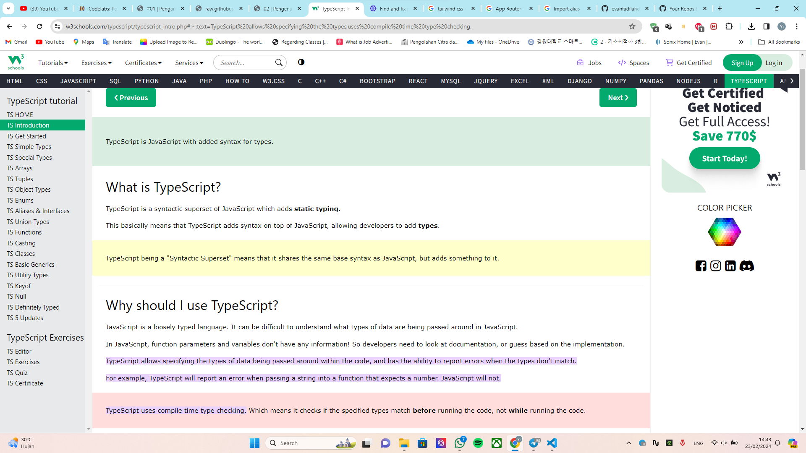
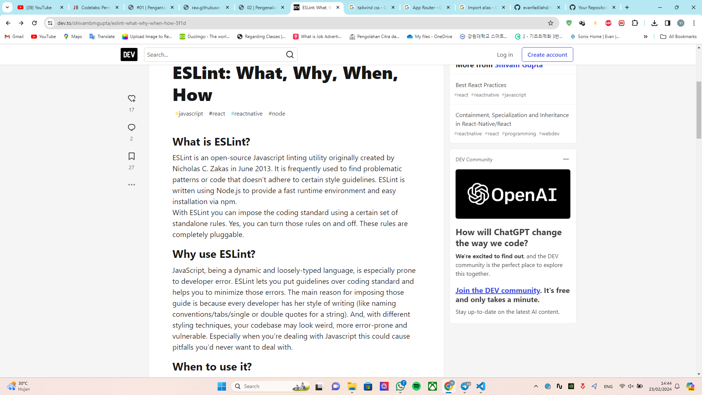
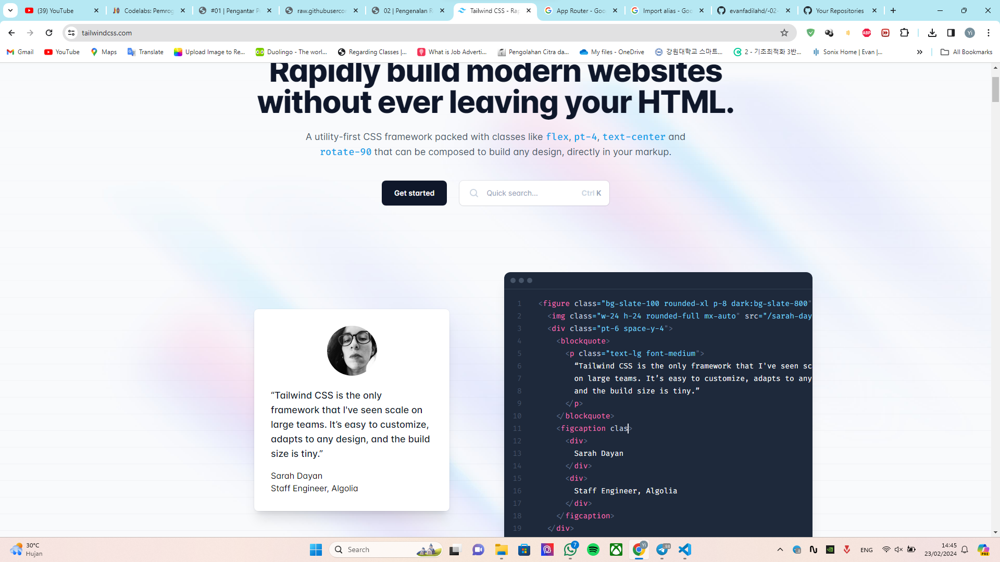
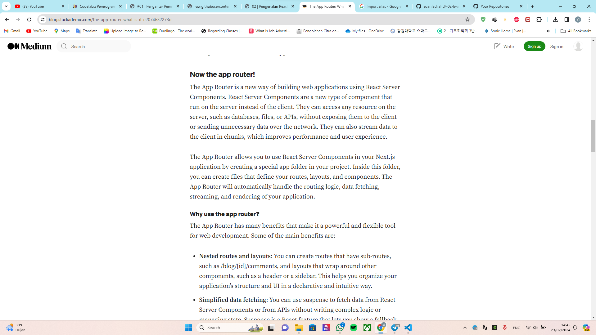
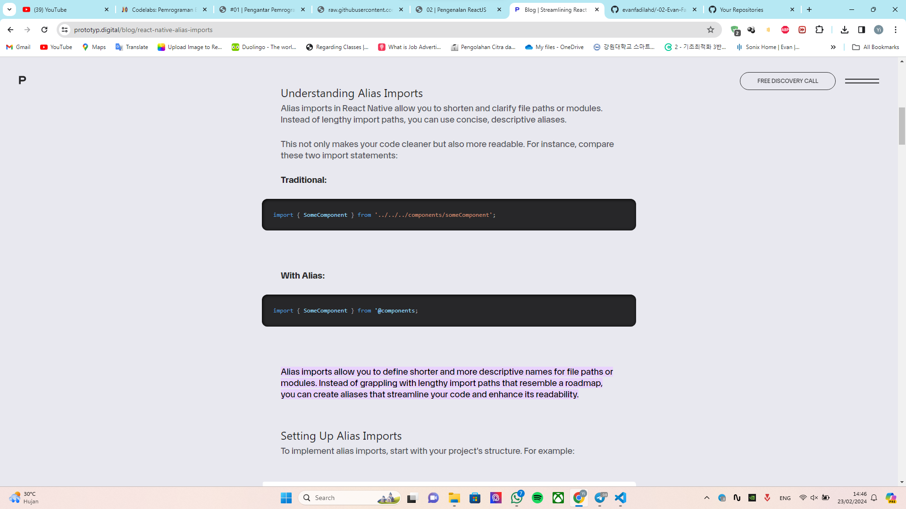

### Jawaban Soal 2

## Define the use of each folder and file!
    
    .git            : This folder is a hidden directory that Git uses to store the repository's metadata and object database.

    node_modules    : This folder contains all the project's dependencies. When you run npm install or yarn install, packages specified in the package.json file are downloaded and stored here.

    public          : This folder contains files that will be publicly accessible from the web server. For web applications, it often includes HTML, CSS, images, and other static assets.

    src             : This folder usually contains the source code of the project. It may be organized further into subdirectories based on the project's architecture or domain logic.

    .eslintrc.json  : This file is used to configure ESLint, which is a popular static code analysis tool for identifying problematic patterns or code that doesn't adhere to certain style guidelines. 

    .gitignore      : This file specifies intentionally untracked files to ignore. It's used in Git version control to prevent certain files from being committed to the repository, such as build artifacts or sensitive information.

    next.config.mjs : This file is used in Next.js projects to provide configuration options for the Next.js framework. It's written in JavaScript ES Modules (hence the .mjs extension) and allows developers to customize various aspects of their Next.js application.

    next-env.d.ts   : This is a TypeScript declaration file. Declaration files in TypeScript provide type information for code that exists in external JavaScript libraries or modules. 

    package.json    : This file is a manifest for the project and includes metadata such as the project name, version, dependencies, and scripts.

    package-lock.json: This file is used by npm (Node Package Manager) to lock down the version of each package's dependencies installed in a project.

    postcss.config.js: This file is used to configure PostCSS, a tool for transforming CSS with JavaScript plugins.

    README.md       : This file is a crucial component of most software projects and serves multiple purposes.

    tailwind.config.js : This file is used in Tailwind CSS projects to customize the default configuration of the Tailwind utility-first CSS framework.

    tsconfig.json   : This file is used in TypeScript projects to specify compiler options and configure how TypeScript code should be compiled.

### Jawaban Soal 3

Screenshot proof:

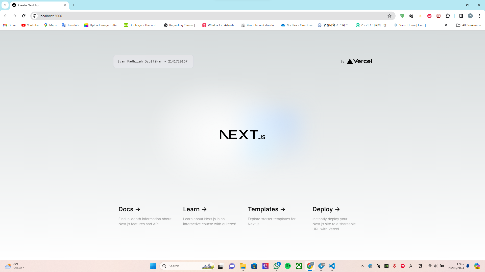

## Question Answer

    It happens because of a feature called Hot Module Replacement (HMR) or Live Reloading that is integrated in the development environment(in this case is ReactJS), such as Webpack Dev Server or similar tools. 

    So when any file changes on our fs, it will delete the file from the front-end build cache. Webpack will reload our root.jsx file, this then re-load the deleted files. Any parent file, that required the deleted file, will also get deleted from the cache, and so on and so forth for grandparents of deleted files, and it stops at root.jsx. So root.jsx should be the only grandparent of any/all the files you want to reload!

### Practicum Assignment

What is the difference between these framework?

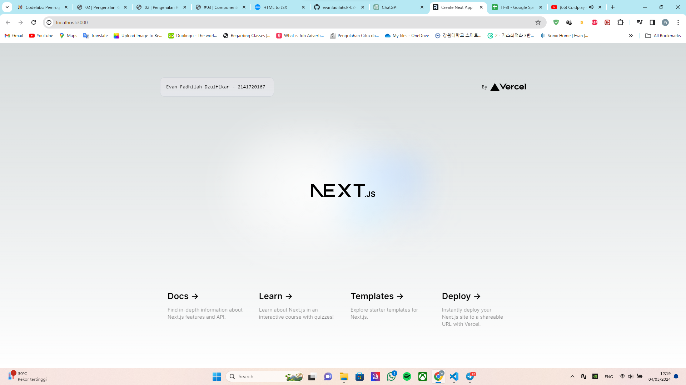
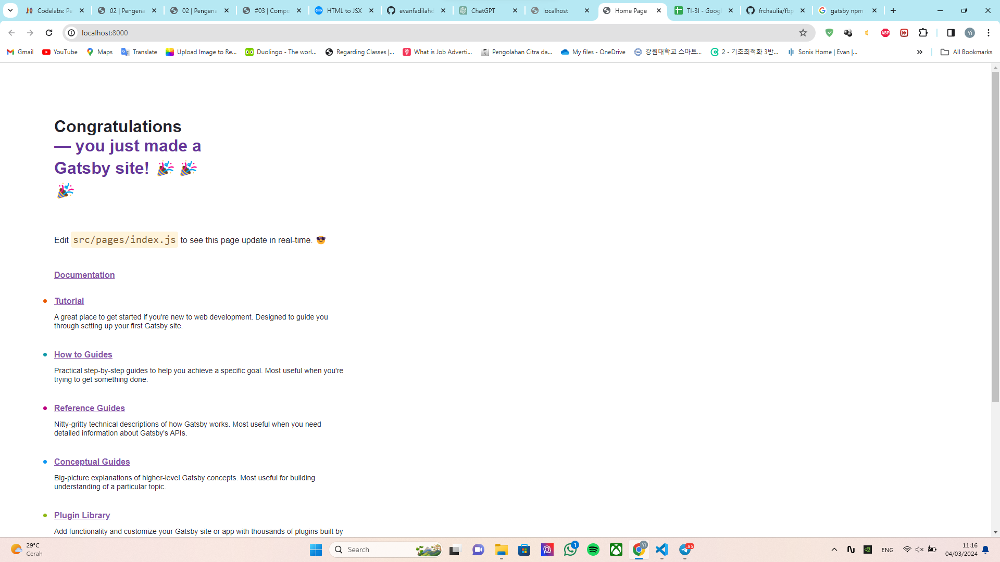
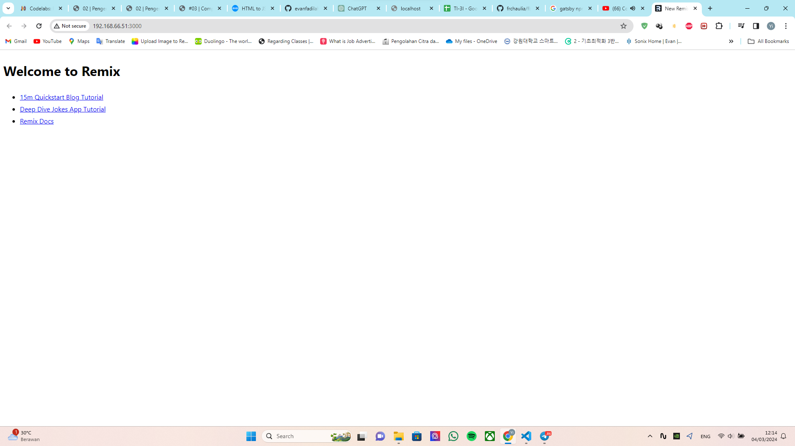

    The main differences between Next.js, Remix, and Gatsby lie in their approaches to rendering (server-side rendering, static site generation), data fetching, and the overall focus of the framework. Next.js and Remix provide solutions for both server-side rendering and client-side rendering, while Gatsby is primarily focused on static site generation.

    1. Next.js: known for its simplicity and ease of use, particularly for server-side rendering (SSR) and static site generation (SSG).
    2. Remix: is a relatively newer framework compared to Next.js and focusing on a different approach to building web applications. It emphasizes server-rendered React applications with a data-fetching model called "Loader Functions."
    3. Gatsby: is another React-based framework, but it's primarily focused on static site generation (SSG).

    Other than that, the file and folder, also the main file have different location.

### Jawaban Soal 4

Explain why it happen!

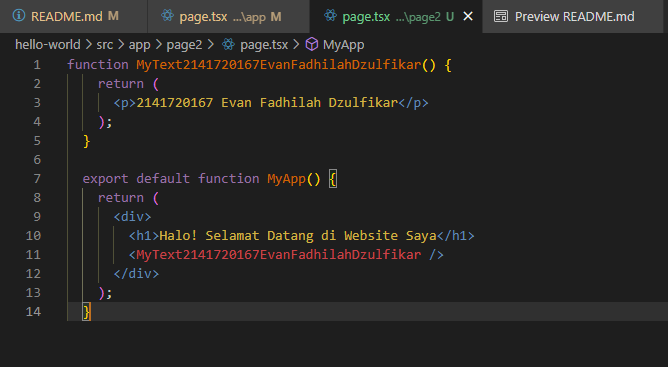
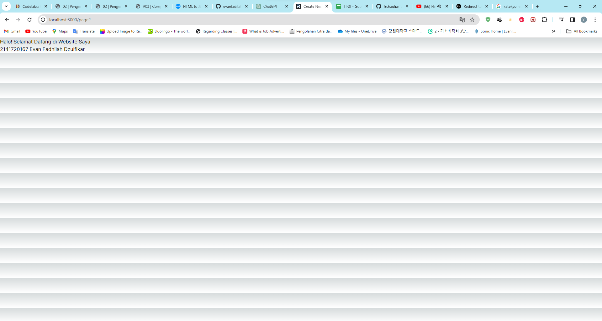

    I think it probably because the page.tsx is importing from default function Home, while I create the function MyTextNimName and it is not in the default function. So I have to export from different function first for it to run!

### Jawaban Soal 5

Is there a change when you call the component in MyPage()?

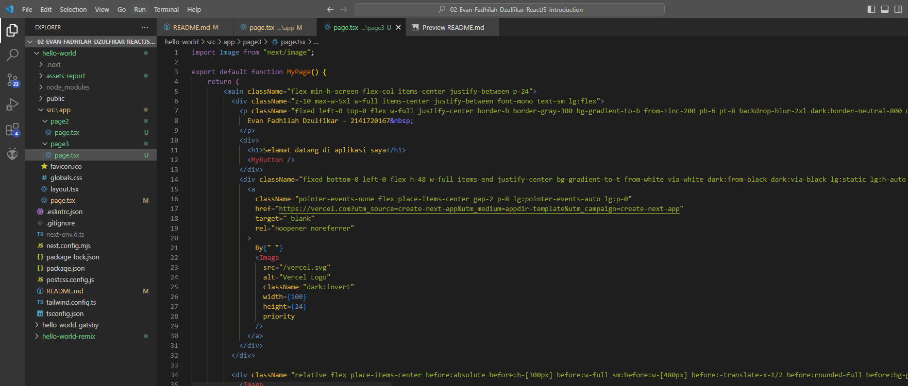
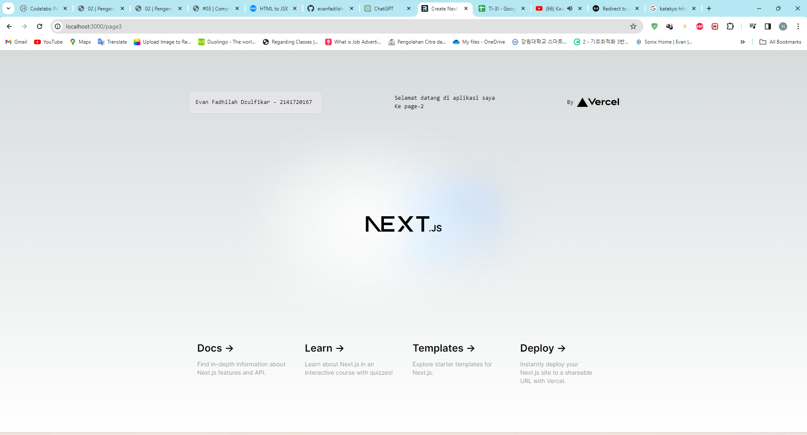

    No, it is the same, even though it have different function, but it using the default function that same as before!

### Jawaban Soal 6

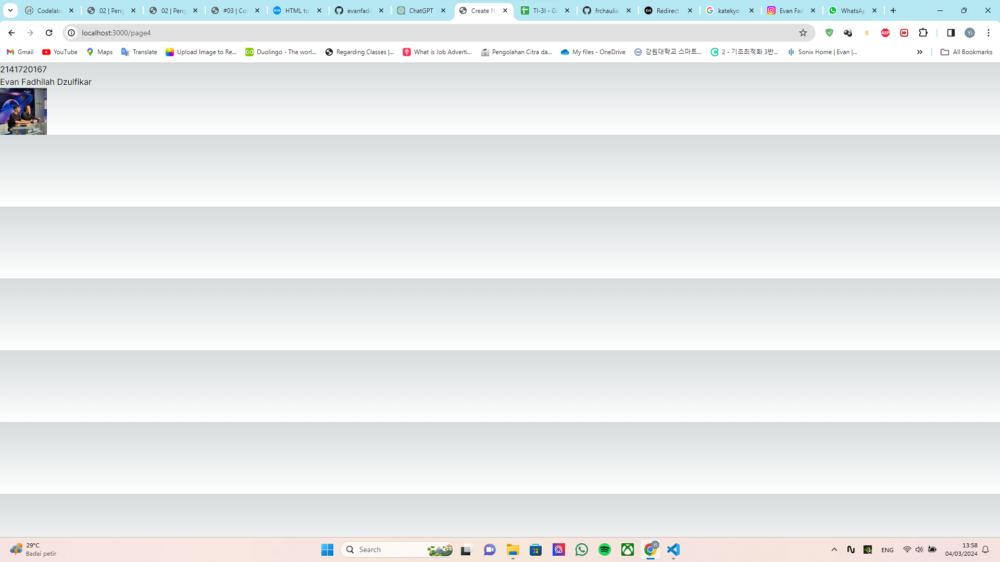